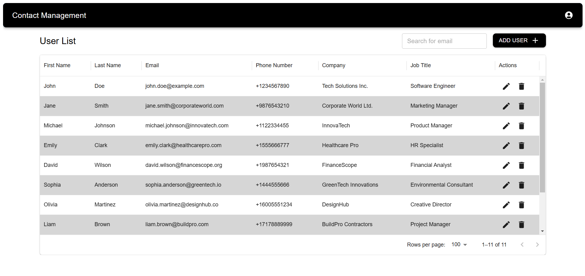

# Frontend for CRM Submission

This is the frontend application for the CRM Submission project. It is built using React and Vite. Its using basic mui components and react-router-dom for routing at home page.

## Prerequisites

Before you begin, ensure you have met the following requirements:
- You have installed Node.js and npm.

## Installation

1. Navigate to the frontend directory:
    ```sh
    cd frontend
    ```

2. Install the dependencies:
    ```sh
    npm install
    ```

## Running the Application

To start the application in development mode, run:
```sh
npm run dev
```

### Preview
